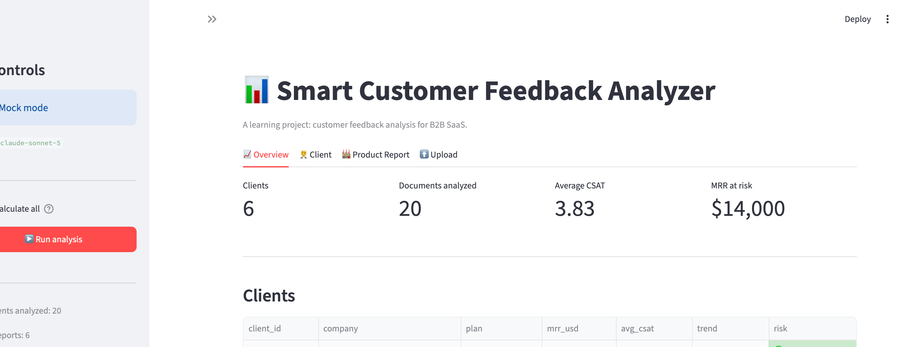
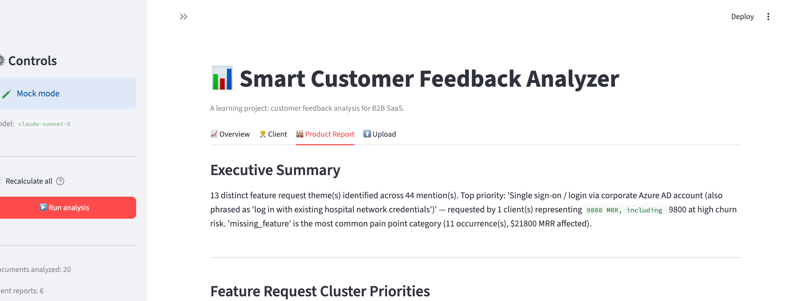
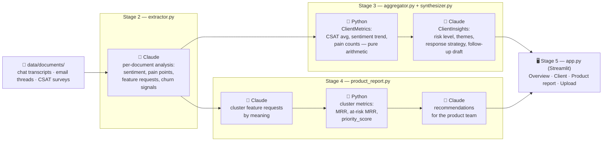

# Smart Customer Feedback Analyzer

Turns scattered customer feedback — support chats, email threads, CSAT
surveys — into a prioritized, quote-backed action plan for CS and Product
teams, using Claude for the parts that need judgment and plain Python for
everything that's just arithmetic.

**🔗 Live demo:** [fbatest.streamlit.app](https://fbatest.streamlit.app/)
(runs in mock mode — no API key needed to explore it).

## Why I built this

Every B2B SaaS company sits on customer feedback that never gets read as a
whole. Two failure modes keep showing up:

- **CSMs miss silent churn.** A client can stay polite, keep a decent CSAT
  score, and still be quietly circling the drain — the same unresolved
  request coming back a third time, phrased a little more patiently each
  time ("no rush, just flagging it again"). By the time the tone turns
  openly negative, the renewal conversation is already lost.
- **Product loses feature requests in translation.** Three different
  clients ask for the same capability — "SSO", "login through our Azure
  AD", "log in with Google" — and because nobody connects the dots, it
  looks like three small, low-priority asks instead of one request backed
  by real MRR.

This project is a working prototype of a pipeline built to catch both: an
explicit `hidden_dissatisfaction` signal per client, and a feature-request
clustering step meant to unify differently-worded asks into one
revenue-weighted priority.

## What it does

- Extracts structured signal from each raw document — sentiment, pain
  points, feature requests, praise, churn signals, hidden dissatisfaction —
  with every claim backed by a verbatim quote.
- Builds a per-client report: CSAT trend, risk level, key themes, a
  ready-to-edit response strategy, and a follow-up email draft.
- Clusters feature requests across all clients by meaning (not exact
  wording) and ranks them by a transparent, revenue-weighted priority score.
- Produces a product-team-facing report: top recommendations, quick wins,
  and named at-risk MRR if nothing is done.
- Ships as a Streamlit app: browse everything, upload new documents,
  re-run the pipeline, and download every report.
- Runs end-to-end without an API key (mock mode) — every field is
  schema-valid, so the rest of the pipeline can be built and tested before
  spending a cent on the API.

## Screenshots

*(placeholders — drop PNGs into `docs/screenshots/` and they'll render here)*

| Overview | Client detail |
|---|---|
|  |  |

| Product report | Upload |
|---|---|
|  |  |

## Architecture



🤖 = Claude (or its mock stand-in) · 🐍 = plain Python, no LLM involved.

## Key decisions

**Two-stage analysis: extraction, then synthesis.** Stage 2
(`extractor.py`) reads one document and pulls out facts. Stage 3
(`aggregator.py` + `synthesizer.py`) reads *all* of a client's documents
and reasons about the pattern across them. Collapsing these into one call
would force the model to both extract and interpret in a single pass —
splitting them means each document is analyzed once and cached forever,
while the interpretation step can be re-run cheaply as new documents
arrive.

**Code computes, Claude interprets.** Anything that's arithmetic — CSAT
averages, sentiment trend (first half vs. second half of a client's
timeline), MRR sums, pain-point counts, the feature-request
`priority_score` — is plain Python in `aggregator.py` and
`product_report.py`. Claude is only called where the task genuinely
requires judgment: what a pattern *means*, how risky it is, what to say to
the client. This keeps the numbers deterministic and free, and keeps the
LLM budget spent on the one thing it's actually good at.

**Every insight is backed by a quote.** Every pain point, feature request,
churn signal, and theme carries a verbatim `quote` field pulled from the
source text. Prompts are explicit: don't invent, return an empty list
rather than force an example. This is what makes the output auditable —
a CSM can trace "high churn risk" back to the exact sentence that
triggered it.

**Validating LLM output beyond the schema.** Pydantic catches type errors,
but not every invariant is a type. The feature-request clustering step
(stage 4) must assign every request id to exactly one cluster — no drops,
no duplicates, no invented ids — and that's checked in code
(`product_report._validate_clusters`) after parsing, with one retry and a
safe fallback (one request per cluster) if the model still gets it wrong.

**Caching at every stage.** Extraction results live in `data/extracted/`,
client reports in `data/reports/clients/` — both keyed by filename, both
skipped on re-run unless `--force`/"Recalculate all" is set. Re-running
the pipeline after adding one new document costs one API call, not
twenty.

**Mock mode as a first-class mode, not an afterthought.** `USE_MOCK`
(env var / `st.secrets`, defaults to `True`) swaps every Claude call for a
rule-based stand-in that produces schema-valid, plausible-looking output
from `ground_truth.json`. This let the entire pipeline — schemas, caching,
CLI flags, the Streamlit UI — get built and tested without an API key.
The one place mock mode is honestly weak is feature-request clustering:
grouping by exact wording can't merge "SSO" / "log in with Google" /
"Azure AD login" the way real semantic understanding can — that limitation
is called out directly in the code and is the clearest before/after once a
real key is added.

**Feature prioritization by MRR and risk, not vibes.** `priority_score` is
a weighted, min-max-normalized combination of total MRR behind a request,
how many distinct clients asked for it, and how much of that MRR is
already at high churn risk (weights in `config.PRIORITY_WEIGHTS`, sum to
1.0). It's a formula a product manager can question and adjust, not an
opaque LLM ranking.

## Synthetic data

`data/` ships with 6 fictional B2B SaaS clients and ~20 documents (chat
transcripts, email threads, CSAT surveys) written to exercise specific
scenarios: a happy client, a client openly churning, a client with
**silent** decline (polite tone, dropping CSAT, the same request
resurfacing for months), and clients requesting the same underlying
feature ("SSO") in three different phrasings across three different
documents.

`data/ground_truth.json` records what each client's documents are
*supposed* to contain — sentiment, pain points, feature requests. Mock
mode draws from it directly; in live mode, it's the basis for an eval
(see Roadmap).

## Running locally

### Mock mode (no API key needed)

```bash
git clone <this-repo>
cd feedback-analyzer
python3 -m venv venv
source venv/bin/activate        # Windows: venv\Scripts\activate
pip install -r requirements.txt
streamlit run app.py
```

Click **▶️ Run analysis** in the sidebar — the whole pipeline
(extraction → client reports → product report) runs against the bundled
synthetic data, no key required.

### With a real Claude API key

```bash
cp .env.example .env
# edit .env: ANTHROPIC_API_KEY=sk-ant-...
```

Then set `USE_MOCK=false` — either as an environment variable, in `.env`,
or (on Streamlit Cloud) in **Settings → Secrets**:

```toml
ANTHROPIC_API_KEY = "sk-ant-..."
USE_MOCK = "false"
```

CLI scripts work the same way outside the UI:

```bash
python extractor.py          # stage 2
python synthesizer.py        # stage 3
python product_report.py     # stage 4
```

## Roadmap

- **Eval harness** — score extraction/synthesis output against
  `ground_truth.json` (precision/recall on pain points and feature
  requests, sentiment agreement) to catch prompt regressions before they
  ship, and to quantify exactly how much better live clustering is than
  the mock's exact-string-match fallback.
- **Churn prediction integration** — feed `sentiment_score` and
  `hidden_dissatisfaction` into a health-score model as a leading
  indicator that updates continuously, rather than a static report
  someone has to remember to open.
- **Real integrations** — Intercom, Zendesk, and email (Gmail/Outlook)
  connectors to replace the `data/documents/` folder with a live feed, so
  the pipeline runs on a schedule instead of a button click.

## Stack

Python · Claude API (Anthropic SDK) · Pydantic · Pandas · Streamlit

## License

MIT — see [LICENSE](LICENSE).
